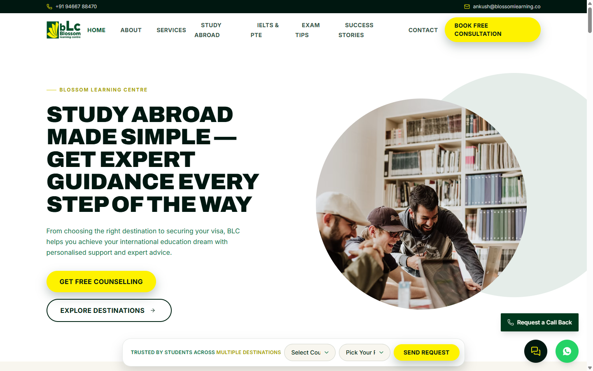
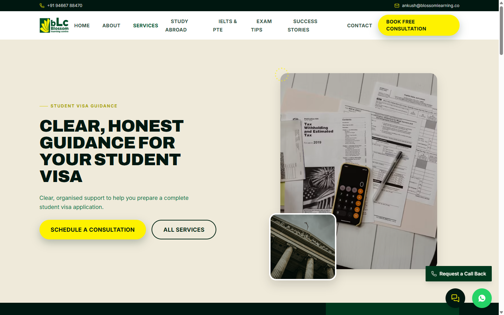
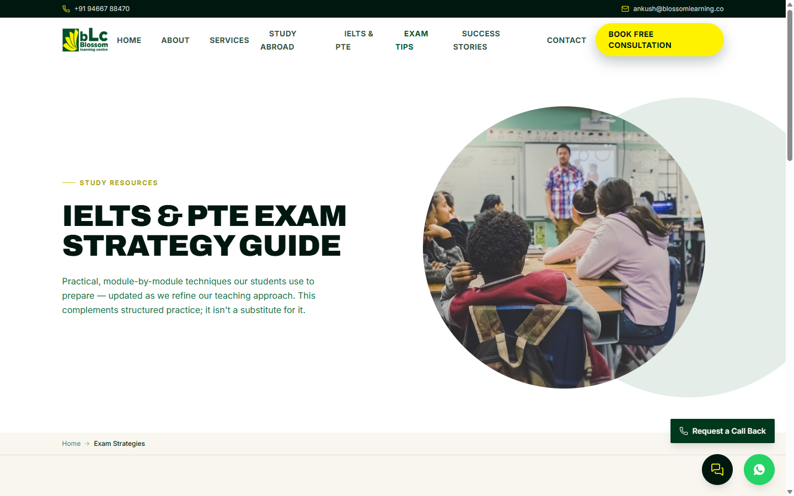
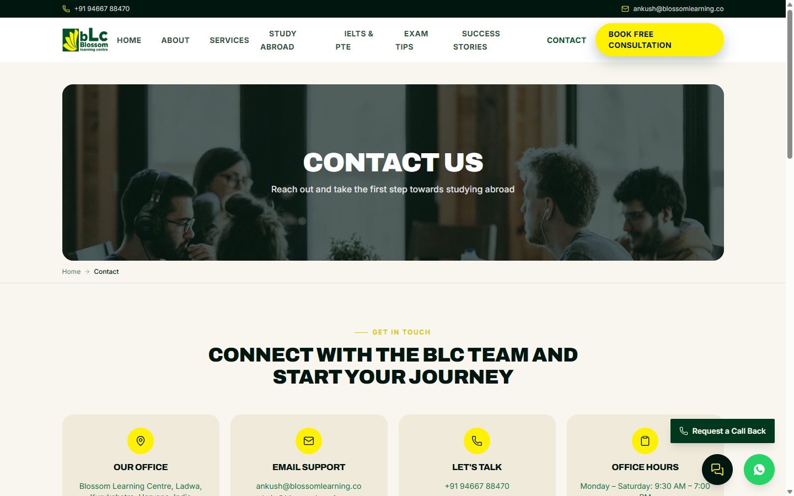

# Blossom Learning Centre — Website

The public website for Blossom Learning Centre (BLC), a study-abroad and immigration
consultancy in Ladwa, Kurukshetra, Haryana — student visa guidance, immigration
consultancy, and IELTS/PTE/Spoken English preparation.

React + TypeScript + Vite + Tailwind CSS. No backend server — enquiries flow straight
into a Google Sheet, and the whole site deploys as static assets.

## Screenshots

| Home | Student Visa |
|---|---|
|  |  |

| Exam Strategies | Contact |
|---|---|
|  |  |

## Features

- Service pages for student visa guidance, immigration consultancy, and IELTS/PTE/Spoken
  English, plus country pages for Australia, the UK, New Zealand and Canada
- An IELTS/PTE exam-strategy resource page with real, module-by-module technique guidance
- Contact form, "Request a Call Back" popup, and newsletter signup — all three feed one
  Google Sheet with a `Source` column so submissions are easy to tell apart
- A floating WhatsApp button and a rule-based "Quick Help" widget that answers common
  questions from the site's own data (not an AI chatbot — see `src/components/ChatWidget.tsx`)
- Privacy Policy, Terms & Conditions, and Refund Policy pages
- A "Meet the Directors" leadership section on the About page

## Development

```bash
npm install
npm run dev
```

## Going live: things to configure

1. **Contact form, call-back requests & newsletter signups (one Google Sheet)** — free, no
   submission caps, no backend to maintain. Every entry point on the site — the Contact page
   form, the floating "Request a Call Back" popup, and the newsletter subscribe box — submits
   through the same `submitEnquiry()` helper into the same sheet, tagged with a `Source` column
   (`Contact Form` / `Call Back Request` / `Newsletter Subscription`) so you can filter by which
   one it came from. Follow the steps at the top of `google-apps-script.gs` (create a Sheet,
   paste that script into Apps Script, deploy as a web app, copy the URL) then set
   `VITE_GSHEET_WEBHOOK_URL` in a `.env` file (see `.env.example`). Without it, forms still work
   but only log submissions to the browser console. The Google Sheet itself doubles as your admin
   view — no separate dashboard needed; open it, sort/filter, add a "Status" column, share it with
   staff, or download it as an Excel file any time via File → Download → Microsoft Excel (.xlsx).
2. **WhatsApp button** — the floating button (bottom-right, every page) opens a real WhatsApp
   chat via a `wa.me` deep link pre-filled with an enquiry message, built from `siteInfo.phone`
   in `src/data/site.ts`. No setup needed; update the phone number there if it ever changes.
3. **Analytics (optional)** — set `VITE_GA_ID` to a GA4 Measurement ID to enable pageview tracking.
4. **Testimonials & success stories** — `src/data/site.ts` (`testimonials`, `successStories`)
   now link to real videos published on BLC's own YouTube channel (visa approvals and PTE
   results, with real student names). Add more as new videos are published, or replace with
   written quotes if BLC obtains permissioned text testimonials.
5. **Social links** — `src/data/site.ts` (`socialLinks`) links to BLC's verified Instagram
   (@blossom_learning_centre), YouTube, and Facebook. Update if any of these ever change.
6. **Images** — hero and destination images use royalty-free Unsplash stock photography.
   Swap in real photos of the centre or (with permission) students for more authenticity.
7. **Contact details** — phone, email and address in `src/data/site.ts` (`siteInfo`) were
   pulled from the live BLC site at build time; double-check they're still current.

## Build

```bash
npm run build
npm run preview
```

## Deploying on Vercel

1. Go to [vercel.com/new](https://vercel.com/new) and import this GitHub repo.
2. Vercel auto-detects it as a Vite project (build command `npm run build`, output
   directory `dist`) — no changes needed there.
3. Under Project Settings → Environment Variables, add `VITE_GSHEET_WEBHOOK_URL`
   (and `VITE_GA_ID` if using analytics) with the same values as your local `.env`.
   Without this, forms will build fine but only log to the browser console instead
   of reaching your Google Sheet.
4. Deploy. `vercel.json` in this repo rewrites all routes to `index.html`, which
   client-side routing (React Router) needs to work on direct page loads/refreshes.
5. Every push to the connected branch redeploys automatically.

## Structure

- `src/data/site.ts` — all site content (nav, services, destinations, testimonials, etc.)
- `src/components/` — reusable UI components
- `src/pages/` — route-level pages
- `src/lib/submitEnquiry.ts` — contact form submit handler (Google Sheets-backed)
- `google-apps-script.gs` — script to paste into Google Apps Script (see setup steps in the file)
- `src/lib/analytics.ts` — optional GA4 integration
- `docs/screenshots/` — images used in this README
